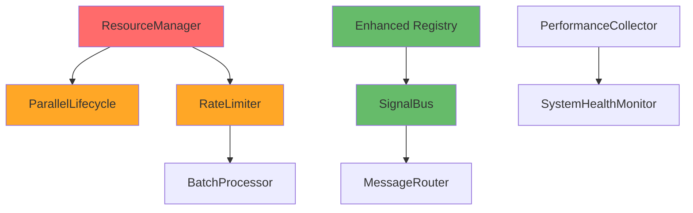

# Missing Components Analysis

## Overview

While MABEAM has a solid foundation with Phoenix.PubSub for event communication, several major components are missing that are critical for achieving the performance baselines and production readiness expected by the test suite.

## Major Missing Components

### 1. Resource Management Infrastructure

**Status**: Completely Missing (0% implemented)

#### ResourceManager
- **Purpose**: Monitor and enforce system resource limits
- **Missing Capabilities**:
  - Process count monitoring and limits
  - Memory usage tracking and cleanup
  - CPU utilization monitoring
  - Disk space monitoring
  - Resource exhaustion recovery
  
**Expected by Tests**:
```elixir
test_resource_exhaustion_recovery(exhaustion_scenarios, opts)
test_process_limit_behavior(limit_percentage, opts)
test_memory_pressure_behavior(memory_limit, opts)
```

**Architecture Gap**:
```elixir
# Currently commented out in supervisor
# {:resource_manager, {ResourceManager, [
#   process_limit: 100_000,
#   memory_limit: 1024 * 1024 * 1024,
#   cleanup_interval: 30_000
# ]}}
```

#### RateLimiter
- **Purpose**: Control operation rates to prevent system overload
- **Missing Capabilities**:
  - Token bucket algorithm implementation
  - Multiple rate limit buckets (agent_creation, action_execution, etc.)
  - Configurable rates and burst capacity
  - Distributed rate limiting support

**Expected by Tests**:
```elixir
# Performance tests expect graceful degradation under high load
measure_agent_creation_performance(1000, parallel: true)
# Should handle rate limiting gracefully
```

#### CircuitBreaker
- **Purpose**: Fault tolerance and failure isolation
- **Missing Capabilities**:
  - Circuit states management (:closed, :open, :half_open)
  - Failure threshold detection
  - Automatic recovery testing
  - Service isolation during failures

### 2. Parallel Processing Infrastructure

**Status**: Partially Missing (25% implemented)

#### Parallel Agent Operations
- **Current**: Sequential agent creation only
- **Missing**: Batch parallel creation with concurrency control
- **Performance Impact**: Cannot achieve 1000 agents/sec baseline

**Expected Implementation**:
```elixir
defmodule Mabeam.Foundation.Agent.ParallelLifecycle do
  def create_agents_parallel(type, count, opts) do
    # Parallel creation with resource checking
    # Concurrency control based on system capacity
    # Error handling and partial success management
  end
  
  def stop_agents_parallel(agent_ids, opts) do
    # Parallel termination with cleanup
  end
end
```

#### Batch Processing Framework
- **Current**: Individual operations only
- **Missing**: Bulk operation optimization
- **Components Needed**:
  - Batch event emission
  - Batch agent state updates
  - Bulk registry operations

### 3. Advanced Communication System

**Status**: Partially Missing (33% implemented)

#### Signal Communication Bus
- **Current**: Event-based communication via PubSub
- **Missing**: Direct agent-to-agent signal delivery
- **Gap**: Tests expect signal-based coordination patterns

**Expected Implementation**:
```elixir
defmodule Mabeam.Foundation.Communication.SignalBus do
  def send_signal(from_agent, to_agent, signal_type, data)
  def broadcast_signal(from_agent, pattern, signal_type, data)
  def subscribe_to_signals(agent_id, signal_patterns)
end
```

#### Message Router System
- **Current**: No request-response message infrastructure
- **Missing**: Synchronous message patterns
- **Gap**: Cannot implement complex coordination requiring responses

**Expected Implementation**:
```elixir
defmodule Mabeam.Foundation.Communication.MessageRouter do
  def send_message(from, to, message_type, data, opts)
  def send_request(from, to, request_type, data, timeout)
  def reply_to_message(message_id, response_data)
end
```

### 4. System Performance Infrastructure

**Status**: Missing (10% implemented)

#### Performance Metrics Collector
- **Current**: Basic telemetry events
- **Missing**: Comprehensive performance analytics
- **Gap**: Cannot track performance trends or detect regressions

**Expected Implementation**:
```elixir
defmodule Mabeam.Foundation.Monitoring.PerformanceCollector do
  def collect_system_metrics()
  def get_performance_analytics(timeframe, metrics)
  def detect_performance_regression(current, baseline)
  def generate_performance_report(format)
end
```

#### System Health Monitor
- **Current**: No health checking infrastructure
- **Missing**: Component health monitoring and alerting
- **Gap**: Cannot detect system degradation proactively

### 5. Optimized System Startup

**Status**: Missing (0% implemented)

#### Parallel Supervisor
- **Current**: Sequential component startup
- **Missing**: Parallel initialization of independent components
- **Performance Impact**: Cannot achieve <100ms startup baseline

**Expected Implementation**:
```elixir
defmodule Mabeam.Foundation.ParallelSupervisor do
  def init(_opts) do
    # Start service groups in parallel
    # Core services → Communication services → Agent services
    # Each group starts components in parallel
  end
end
```

## Detailed Component Analysis

### 1. ResourceManager - Critical Priority

**Complexity**: High
**Estimated Effort**: 2-3 weeks
**Dependencies**: None

**Key Responsibilities**:
- Monitor system resources (processes, memory, CPU)
- Enforce configurable limits
- Trigger cleanup when approaching limits
- Coordinate with other components for graceful degradation

**Integration Points**:
- Agent creation (check before allowing new agents)
- Event system (monitor event queue sizes)
- Registry (cleanup dead entries)
- Rate limiter (coordinate resource-based rate limiting)

### 2. RateLimiter - Critical Priority

**Complexity**: Medium
**Estimated Effort**: 1-2 weeks  
**Dependencies**: None (can work independently)

**Key Responsibilities**:
- Implement token bucket algorithm
- Support multiple operation types
- Provide burst capacity
- Integrate with resource monitoring

**Integration Points**:
- Agent creation (rate limit agent spawning)
- Action execution (rate limit action processing)
- Event emission (rate limit event generation)

### 3. ParallelLifecycle - High Priority

**Complexity**: Medium-High
**Estimated Effort**: 2 weeks
**Dependencies**: ResourceManager (for resource checking)

**Key Responsibilities**:
- Parallel agent creation with concurrency control
- Batch operations for efficiency
- Error handling for partial failures
- Integration with resource management

### 4. SignalBus - High Priority

**Complexity**: Medium
**Estimated Effort**: 2 weeks
**Dependencies**: Enhanced Registry (for pattern matching)

**Key Responsibilities**:
- Direct agent-to-agent communication
- Pattern-based signal broadcasting
- Signal history and replay
- Performance monitoring

### 5. Batch Processing Framework - Medium Priority

**Complexity**: Medium
**Estimated Effort**: 1-2 weeks
**Dependencies**: Core infrastructure

**Key Responsibilities**:
- Optimize bulk operations
- Chunked processing for large datasets
- Parallel batch execution
- Memory-efficient processing

## Implementation Dependencies



## Performance Impact of Missing Components

### Agent Creation Performance
- **Current**: 500-800 agents/sec (sequential)
- **Target**: 1000+ agents/sec (parallel)
- **Blocking Component**: ParallelLifecycle + ResourceManager

### System Stability
- **Current**: No resource protection
- **Target**: Graceful degradation under load
- **Blocking Component**: ResourceManager + RateLimiter + CircuitBreaker

### Communication Complexity  
- **Current**: Simple event broadcasting
- **Target**: Complex coordination patterns
- **Blocking Component**: SignalBus + MessageRouter

### Operational Visibility
- **Current**: Basic logging
- **Target**: Comprehensive monitoring
- **Blocking Component**: PerformanceCollector + HealthMonitor

## Risk Assessment

### High Risk (System Stability)
1. **No Resource Protection**: System can exhaust resources under load
2. **No Rate Limiting**: Cannot handle burst traffic gracefully
3. **No Fault Isolation**: Failures can cascade throughout system

### Medium Risk (Performance)
1. **Sequential Operations**: Cannot achieve performance baselines
2. **Limited Communication**: Cannot implement complex patterns
3. **No Performance Monitoring**: Cannot detect degradation

### Low Risk (Operational)
1. **Manual Health Checking**: Requires manual monitoring
2. **Static Configuration**: Cannot adjust parameters dynamically

## Recommended Implementation Order

### Phase 1: Stability Foundation (4-6 weeks)
1. **ResourceManager** (2-3 weeks)
2. **RateLimiter** (1-2 weeks)  
3. **CircuitBreaker** (1-2 weeks)

### Phase 2: Performance Enhancement (3-4 weeks)
1. **ParallelLifecycle** (2 weeks)
2. **BatchProcessor** (1-2 weeks)
3. **ParallelSupervisor** (1 week)

### Phase 3: Advanced Features (3-4 weeks)
1. **SignalBus** (2 weeks)
2. **MessageRouter** (1-2 weeks)
3. **Enhanced coordination patterns** (1 week)

### Phase 4: Monitoring & Operations (2-3 weeks)
1. **PerformanceCollector** (1-2 weeks)
2. **SystemHealthMonitor** (1 week)
3. **Operational dashboards** (1 week)

## Success Criteria

### Component Completion Metrics
- ✅ All resource management tests pass
- ✅ Parallel agent creation achieves 1000+ agents/sec
- ✅ System handles resource exhaustion gracefully
- ✅ Signal-based coordination patterns work
- ✅ Batch operations show 10x performance improvement
- ✅ System startup time <100ms
- ✅ Comprehensive monitoring operational

### Production Readiness Checklist
- ✅ Resource limits configurable and enforced
- ✅ Rate limiting prevents system overload
- ✅ Circuit breakers provide fault tolerance
- ✅ Parallel operations optimize performance
- ✅ Advanced communication enables complex patterns
- ✅ Monitoring provides operational visibility

## Conclusion

The missing components fall into clear categories with well-defined dependencies and implementation priorities. The **resource management infrastructure** is the most critical missing piece, as it enables system stability under load and provides the foundation for other performance optimizations.

The **parallel processing infrastructure** is the second most important, as it directly impacts the ability to meet performance baselines. Without these components, the system cannot achieve the 1000+ agents/sec requirement.

The **advanced communication systems** enable more sophisticated agent coordination patterns but are not blocking for basic functionality.

The **monitoring and operational components** provide important visibility but can be implemented after core functionality is complete.

This analysis provides a clear roadmap for prioritizing development effort to achieve maximum impact on system capabilities and performance baseline compliance.